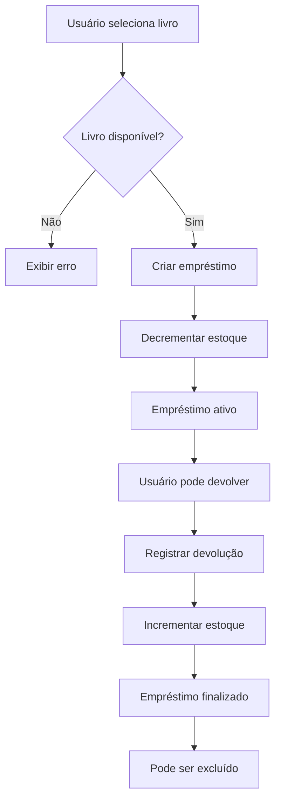

# Plugin de Gerenciamento de Empréstimos - README

Este documento descreve o plugin de gerenciamento de empréstimos (`LoanPlugin`) que faz parte do sistema baseado em microkernel para bibliotecas.

## 📋 Visão Geral

O `LoanPlugin` é um componente plugável que implementa funcionalidades de gestão de empréstimos para o sistema Alexandria, seguindo uma arquitetura de microkernel. Este plugin fornece uma interface gráfica completa para:

- ✅ Registrar novos empréstimos
- 🔍 Buscar empréstimos existentes
- 👁️ Visualizar detalhes dos empréstimos
- ✏️ Editar empréstimos ativos
- 📅 Registrar devoluções
- 🗑️ Excluir empréstimos finalizados (com confirmação)
- ⚠️ Controlar regras de negócio (disponibilidade, datas, etc.)

## 🏗️ Estrutura do Plugin

```
loanplugin/
├── pom.xml                           # Configuração Maven
├── README.md                         # Esta documentação
└── src/main/
    ├── java/br/edu/ifba/inf008/plugins/
    │   ├── LoanPlugin.java           # Classe principal do plugin
    │   ├── controller/
    │   │   └── LoanController.java   # Controlador MVC
    │   ├── service/
    │   │   ├── LoanService.java      # Serviço principal de empréstimos
    │   │   ├── LoanBookService.java  # Serviço de acesso aos livros
    │   │   └── LoanUserService.java  # Serviço de acesso aos usuários
    │   └── ui/
    │       ├── LoanUIUtils.java      # Utilitários de UI
    │       └── components/
    │           └── LoanTableFactory.java    # Fábrica para tabela de empréstimos
    └── resources/
        ├── fxml/
        │   └── LoanView.fxml         # Interface FXML
        └── styles/
            └── loan-theme.css        # Estilos específicos do plugin
```

## ⚙️ Funcionalidades Detalhadas

### 📝 Registro de Empréstimos

**Processo de criação:**
1. Selecionar usuário no ComboBox
2. Selecionar livro disponível no ComboBox
3. Definir data de empréstimo (padrão: hoje)
4. Confirmar registro

**Validações implementadas:**
- Usuário deve estar selecionado
- Livro deve estar selecionado e disponível
- Data de empréstimo não pode ser futura
- Livro deve ter cópias disponíveis (> 0)
- Verificação automática de disponibilidade

### 🔍 Sistema de Busca e Visualização

**Características da interface:**
- **Tabela de empréstimos**: Exibe todos os empréstimos com colunas:
  - ID do Empréstimo
  - Nome do usuário
  - Email do usuário  
  - Título do livro
  - ISBN do livro
  - Data de empréstimo
  - Data de devolução (se houver)
  - Status (Ativo/Devolvido)

**Filtros e ordenação:**
- Filtro de busca por usuário, livro e data de empréstimo
- Destaque visual para empréstimos ativos
- Identificação clara de empréstimos finalizados

### ✏️ Edição de Empréstimos

**Processo de edição:**
1. Selecionar empréstimo na tabela
2. Clicar em "Editar"
3. Formulário é preenchido com dados atuais
4. Campo de data de devolução fica visível
5. Modificar dados conforme necessário
6. Salvar ou cancelar

**Características especiais:**
- **Data de devolução**: Campo adicional aparece durante edição
- **Validação de datas**: Data de devolução deve ser posterior à data de empréstimo
- **Controle de estoque**: Atualização automática de cópias disponíveis

### 📅 Registro de Devoluções

**Processo simplificado:**
1. Selecionar empréstimo ativo na tabela
2. Clicar em "Registrar Devolução"
3. Sistema automaticamente:
   - Define data de devolução como hoje
   - Atualiza status do empréstimo
   - Incrementa cópias disponíveis do livro
   - Exibe mensagem de confirmação

### 🗑️ Exclusão de Empréstimos

**Processo com confirmação obrigatória:**
1. Selecionar empréstimo na tabela
2. Clicar em "Excluir"
3. **Verificação de regras de negócio**:
   - Só permite excluir empréstimos devolvidos
   - Empréstimos ativos não podem ser excluídos
4. **Pop-up de confirmação** com informações detalhadas:
   - Título do livro
   - Nome do usuário
   - Pergunta de confirmação clara
5. Confirmar ou cancelar exclusão

## 🎨 Interface do Usuário


### Sistema de Mensagens

O plugin implementa sistema completo de feedback visual seguindo o padrão dos demais plugins:

```java
// Mensagens de erro (vermelho)
LoanUIUtils.displayErrorMessage(lblMessage, "Selecione um usuário");

// Mensagens de sucesso (verde)  
LoanUIUtils.displaySuccessMessage(lblMessage, "Empréstimo cadastrado com sucesso!");

// Mensagens de confirmação/aviso (amarelo)
LoanUIUtils.displayConfirmationMessage(lblMessage, "Editando empréstimo...");

// Limpar mensagens
LoanUIUtils.clearMessage(lblMessage);

// Pop-up de confirmação
boolean confirmed = LoanUIUtils.showConfirmation("Deseja continuar com a exclusão?");
```

**Classes CSS aplicadas:**
- `.message-error`: Texto vermelho para erros e validações
- `.message-success`: Texto verde para operações bem-sucedidas
- `.message-warning`: Texto amarelo para avisos e confirmações
- `.message-info`: Texto azul para informações gerais

## 🚀 Uso

1. **Preparar dados** (usuários e livros devem estar cadastrados):

2. **Usar funcionalidades do plugin**:
   - Acessar aba "Gerenciamento" e 
   - Selecionar usuário e livro
   - Registrar empréstimo
   - Gerenciar devoluções

## 🔄 Ciclo de Vida e Regras de Negócio

### Fluxo de um Empréstimo



### Regras de Negócio Implementadas

1. **Disponibilidade de livros**:
   - Só permite empréstimo se `copies_available > 0`
   - Decrementa automaticamente ao criar empréstimo
   - Incrementa automaticamente ao registrar devolução

2. **Validação de datas**:
   - Data de empréstimo não pode ser futura
   - Data de devolução deve ser posterior à data de empréstimo
   - Data de devolução padrão é a data atual

3. **Exclusão de empréstimos**:
   - Só permite excluir empréstimos devolvidos
   - Empréstimos ativos não podem ser excluídos
   - Confirmação obrigatória antes da exclusão

4. **Integridade de dados**:
   - Verificação de usuário válido
   - Verificação de livro válido
   - Transações atômicas para operações críticas

## 📚 Links Relacionados

- [📖 README Principal](../../../README.md)
- [🏗️ README do Microkernel](../../README.md)
- [📚 Plugin de Livros](../bookplugin/README.md)
- [👥 Plugin de Usuários](../userplugin/README.md)
- [📊 Plugin de Relatórios](../reportplugin/README.md)

---

**Desenvolvido por:** Marcus Vinicius Silva da Fonseca
**Disciplina:** INF008 - POO
**Instituição:** IFBA